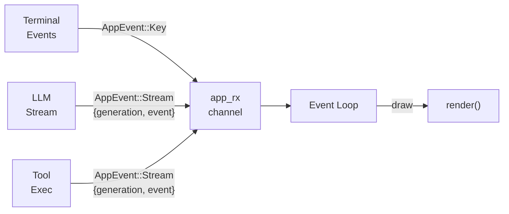
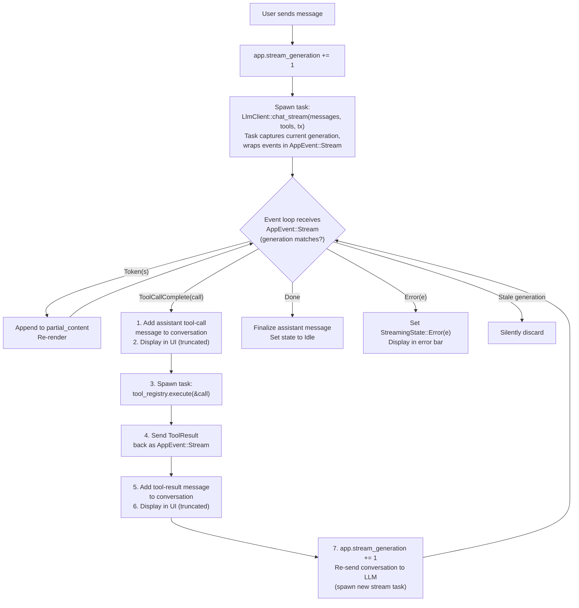

# Scaffy — Agent Scaffold Spec

## Overview

Scaffy is a TUI-based LLM agent scaffold built in Rust. It provides a chat interface with streaming responses, tool calling, and an internal conversation model decoupled from any LLM provider's wire format. The initial backend is OpenRouter (via `async-openai`'s configurable base URL).

## Dependencies

```toml
[dependencies]
async-openai = "0.27"
tokio = { version = "1", features = ["full"] }
serde = { version = "1", features = ["derive"] }
serde_json = "1"
dotenvy = "0.15"
anyhow = "1"
async-trait = "0.1"
tracing = "0.1"
tracing-subscriber = "0.3"
ratatui = "0.29"
crossterm = "0.28"
tui-textarea = "0.7"
uuid = { version = "1", features = ["v4"] }
futures = "0.3"
```

### Dependency Notes

- `async-openai` provides streaming, tool calling, and built-in retry with exponential backoff on rate limits. Configurable base URL supports OpenRouter and any OpenAI-compatible provider.
- `futures` is needed for `StreamExt` to consume `async-openai`'s streaming responses.
- `tui-textarea 0.7` targets `ratatui 0.29` + `crossterm 0.28` — verified compatible.
- No `chrono` — timestamps use `std::time::SystemTime`.

All dependencies added via `cargo add`.

## Project Structure

```
src/
  main.rs          — entry point, terminal setup, event loop
  app.rs           — app state, event dispatch
  conversation.rs  — internal message model (ChatMessage, Conversation, Role)
  tools.rs         — ToolHandler trait, ToolRegistry
  ui.rs            — Ratatui layout and rendering
  llm_client.rs    — OpenRouter integration via async-openai
```

---

## Internal Conversation Model (`conversation.rs`)

Decoupled from `async-openai`'s types so we can:
- Add metadata (timestamps, IDs, token counts)
- Persist conversations without depending on a provider's types
- Transform messages before sending (truncation, summarization)
- Swap providers without touching the rest of the codebase

### Types

```rust
#[derive(Clone, Debug, Serialize, Deserialize)]
pub enum Role {
    System,
    User,
    Assistant,
    Tool,
}

#[derive(Clone, Debug, Serialize, Deserialize)]
pub struct ToolCall {
    pub id: String,
    pub name: String,
    pub arguments: serde_json::Value,
}

#[derive(Clone, Debug, Serialize, Deserialize)]
pub struct ToolResult {
    pub tool_call_id: String,
    pub content: String,
}

#[derive(Clone, Debug, Serialize, Deserialize)]
pub struct MessageMetadata {
    pub id: Uuid,
    pub timestamp: std::time::SystemTime,
    pub model: Option<String>,
    pub token_count: Option<u32>,
}

#[derive(Clone, Debug, Serialize, Deserialize)]
pub struct ChatMessage {
    pub role: Role,
    pub content: Option<String>,
    pub tool_calls: Option<Vec<ToolCall>>,
    pub tool_result: Option<ToolResult>,
    pub metadata: MessageMetadata,
}
```

### Constructors

Type-safe constructors prevent invalid states:

```rust
impl ChatMessage {
    pub fn system(content: &str) -> Self;
    pub fn user(content: &str) -> Self;
    pub fn assistant(content: &str) -> Self;
    pub fn assistant_tool_calls(calls: Vec<ToolCall>) -> Self;
    pub fn tool_result(tool_call_id: &str, content: &str) -> Self;
}
```

### Conversation Methods

```rust
impl Conversation {
    pub fn new() -> Self;
    pub fn push(&mut self, message: ChatMessage);
    pub fn len(&self) -> usize;
    pub fn is_empty(&self) -> bool;
    pub fn last_assistant_message(&self) -> Option<&ChatMessage>;
    pub fn clear(&mut self);

    /// Convert internal messages to async-openai request messages
    pub fn to_openai_messages(&self) -> Vec<ChatCompletionRequestMessage>;

    /// Convert an async-openai response back into our internal types
    pub fn push_from_response(&mut self, response: &CreateChatCompletionResponse);
}
```

---

## Tool System (`tools.rs`)

### ToolHandler Trait

```rust
#[async_trait]
pub trait ToolHandler: Send + Sync {
    /// Unique name matching what the LLM will call
    fn name(&self) -> &str;

    /// Human-readable description for the LLM
    fn description(&self) -> &str;

    /// JSON Schema describing the expected arguments
    fn parameters_schema(&self) -> serde_json::Value;

    /// Execute the tool with parsed arguments, return result as string
    async fn execute(&self, args: serde_json::Value) -> Result<String>;
}
```

### ToolRegistry

```rust
pub struct ToolRegistry {
    handlers: HashMap<String, Box<dyn ToolHandler>>,
}

impl ToolRegistry {
    pub fn new() -> Self;
    pub fn register(&mut self, handler: impl ToolHandler + 'static);
    pub fn get(&self, name: &str) -> Option<&dyn ToolHandler>;

    /// Convert all registered tools to async-openai ChatCompletionTool types
    pub fn to_openai_tools(&self) -> Vec<ChatCompletionToolArgs>;

    /// Execute a tool call by name, returns the result string
    pub async fn execute(&self, tool_call: &ToolCall) -> Result<String>;
}
```

### Integration with async-openai

Each `ToolHandler` maps to a `ChatCompletionToolArgs`:

```rust
ChatCompletionToolArgs::default()
    .r#type(ChatCompletionToolType::Function)
    .function(
        FunctionObjectArgs::default()
            .name(handler.name())
            .description(handler.description())
            .parameters(handler.parameters_schema())
            .build()?
    )
    .build()?
```

---

## Stream Events (`llm_client.rs`)

`async-openai` streams `CreateChatCompletionStreamResponse` items containing `ChatChoiceDelta` variants. We define our own event type to decouple from the crate:

```rust
pub enum StreamEvent {
    /// A chunk of text content
    Token(String),

    /// A tool call is being assembled (partial arguments arriving)
    ToolCallStart { index: usize, id: String, name: String },

    /// A fragment of tool call arguments (JSON being streamed)
    ToolCallArgDelta { index: usize, arguments: String },

    /// A fully assembled tool call, ready to execute
    ToolCallComplete(ToolCall),

    /// Stream finished
    Done { stop_reason: Option<String> },

    /// LLM or network error
    Error(String),
}
```

### Stream Parsing

The `LlmClient` accumulates streamed tool calls and converts to `StreamEvent`:

```rust
/// Accumulator for assembling streamed tool calls
struct ToolCallAccumulator {
    calls: HashMap<usize, PartialToolCall>,
}

struct PartialToolCall {
    id: String,
    name: String,
    arguments: String,  // JSON fragments appended as they arrive
}

impl ToolCallAccumulator {
    fn process_delta(&mut self, delta: &ChatCompletionMessageToolCallChunk) -> Option<StreamEvent>;
    fn finalize(self) -> Vec<ToolCall>;
}
```

Each `ChatChoiceDelta` is inspected:
- `delta.content` → `StreamEvent::Token`
- `delta.tool_calls[i]` with `id` + `function.name` → `StreamEvent::ToolCallStart`
- `delta.tool_calls[i]` with `function.arguments` fragment → `StreamEvent::ToolCallArgDelta`
- `finish_reason == "tool_calls"` → finalize accumulator → `StreamEvent::ToolCallComplete` for each
- `finish_reason == "stop"` → `StreamEvent::Done`

This keeps the rest of the app (event loop, UI) independent of `async-openai`'s types.

---

## LLM Client (`llm_client.rs`)

Wraps `async-openai` and exposes a clean async interface.

### Configuration

```rust
pub struct LlmClientConfig {
    pub base_url: String,     // e.g. "https://openrouter.ai/api/v1"
    pub api_key: String,      // from env: OPENROUTER_API_KEY
    pub model: String,        // e.g. "anthropic/claude-sonnet-4"
    pub max_tokens: u32,
    pub temperature: f32,
    pub system_prompt: Option<String>,
}
```

Uses `async-openai`'s configurable `OpenAIConfig` under the hood:

```rust
let config = OpenAIConfig::new()
    .with_api_key(&config.api_key)
    .with_api_base(&config.base_url);

let client = Client::with_config(config);
```

### Retry Behavior

`async-openai` provides built-in retry with exponential backoff on rate-limit responses (HTTP 429). This covers OpenRouter's rate limiting out of the box. For other transient errors (5xx, timeouts), we wrap calls with a simple retry layer:

```rust
/// Retry config for transient failures beyond rate limits
pub struct RetryConfig {
    pub max_retries: u32,         // default: 3
    pub initial_backoff_ms: u64,  // default: 1000
    pub max_backoff_ms: u64,      // default: 30000
    pub backoff_multiplier: f64,  // default: 2.0
}
```

### Methods

```rust
impl LlmClient {
    pub fn new(config: LlmClientConfig) -> Result<Self>;

    /// Streaming chat — sends StreamEvents through the provided channel.
    /// Returns immediately; tokens arrive asynchronously via the sender.
    pub async fn chat_stream(
        &self,
        messages: &[ChatCompletionRequestMessage],
        tools: Option<&[ChatCompletionToolArgs]>,
        tx: mpsc::Sender<StreamEvent>,
    );
}
```

The single `chat_stream` method handles both tool and non-tool cases. When `tools` is `None`, `ToolCall*` events will never be emitted. The channel-based design means the event loop never blocks on LLM I/O.

Internally, `chat_stream` builds a `CreateChatCompletionRequest` and calls `client.chat().create_stream()`:

```rust
let mut request = CreateChatCompletionRequestArgs::default()
    .model(&self.config.model)
    .max_tokens(self.config.max_tokens)
    .temperature(self.config.temperature)
    .messages(messages)
    .build()?;

if let Some(tools) = tools {
    request.tools = Some(tools.to_vec());
}

let mut stream = self.client.chat().create_stream(request).await?;

while let Some(result) = stream.next().await {
    match result {
        Ok(response) => {
            // Parse ChatChoiceDelta into StreamEvents via accumulator
            // Send each event through tx
        }
        Err(e) => {
            let _ = tx.send(StreamEvent::Error(e.to_string())).await;
            break;
        }
    }
}
```

---

## TUI (`ui.rs`)

### Layout

```
+-----------------------------------------------+
|  Model: anthropic/claude-sonnet-4  | streaming |  <- Status bar
+-----------------------------------------------+
|                                                 |
|  User: What's the weather in Paris?             |
|                                                 |
|  Assistant: I'll check the weather for you.     |
|                                                 |
|  [Tool Call: get_weather(city: "Paris")]         |  <- Truncated, expandable
|  [Tool Result: 15C, partly cloudy]              |  <- Truncated, expandable
|                                                 |
|  Assistant: The weather in Paris is 15C and     |
|  partly cloudy.                                 |
|                                                 |
+-----------------------------------------------+
|  > Type a message...                            |  <- tui-textarea (multi-line)
|                                                 |
+-----------------------------------------------+
|  Error: Connection timed out                    |  <- Error bar (only when error)
+-----------------------------------------------+
```

### Panels

1. **Status bar** (top) — model name, streaming indicator, token count
2. **Message history** (center, scrollable) — all messages rendered by role
3. **Input area** (bottom) — `tui-textarea` widget for multi-line input
4. **Error bar** (bottom, conditional) — shown only when an error occurs, dismissed with Esc

### Tool Call/Result Display

- Tool calls and results are shown inline in the message history
- Truncated by default (single line summary)
- Expandable: press Enter when the cursor is on a tool block to toggle full view
- Visual distinction: different color/border from regular messages

### Keybindings

| Key | Action |
|-----|--------|
| Enter | Send message (when input focused) |
| Shift+Enter | Newline in input |
| Ctrl+C | Quit |
| Up/Down | Move cursor through messages (when history focused) |
| Tab | Toggle focus between input and history |
| Enter (on tool block) | Expand/collapse tool call/result |
| Esc | Clear error / cancel / return focus to input |

---

## App State (`app.rs`)

```rust
pub enum AppFocus {
    Input,
    History,
}

pub enum StreamingState {
    Idle,
    Streaming { partial_content: String },
    Error(String),
}

/// Wrapper sent through the event channel. Tags StreamEvents with the
/// generation that produced them so the event loop can discard stale ones.
pub enum AppEvent {
    Key(crossterm::event::KeyEvent),
    Stream { generation: u64, event: StreamEvent },
}

pub struct App {
    pub conversation: Conversation,
    pub tool_registry: ToolRegistry,
    pub textarea: TextArea<'static>,
    pub focus: AppFocus,
    pub streaming: StreamingState,
    pub stream_generation: u64,                    // bumped each time a new stream is spawned
    pub scroll_offset: u16,
    pub selected_message: Option<usize>,           // cursor index into history
    pub expanded_tool_blocks: HashSet<Uuid>,        // message IDs of expanded tool blocks
    pub should_quit: bool,
}
```

Generation tracking lives entirely in `App` — the `LlmClient` has no knowledge of generations. When spawning a stream or tool-execution task, the caller captures `app.stream_generation` into the task closure and wraps each `StreamEvent` in `AppEvent::Stream { generation, event }` before sending. The event loop checks `generation == app.stream_generation` and silently drops mismatches.

---

## Event Loop (`main.rs`)

Architecture: tokio + crossterm event polling with channel-based message passing.



```rust
#[tokio::main]
async fn main() -> Result<()> {
    // 1. Load .env
    // 2. Init tracing (to file, not stdout — stdout is the TUI)
    // 3. Setup terminal (crossterm raw mode, alternate screen)
    // 4. Create App state with ToolRegistry
    // 5. Create LlmClient
    // 6. Run event loop (single channel for all AppEvents):
    //    match app_rx.recv().await {
    //        AppEvent::Key(key) => handle_input(key),
    //        AppEvent::Stream { generation, event } => {
    //            if generation == app.stream_generation {
    //                handle_stream_event(event);
    //            }
    //            // else: stale generation, silently discard
    //        }
    //    }
    //    terminal.draw(|f| ui::render(f, &app))?;
    // 7. Restore terminal on exit
}
```

---

## Agent Loop (tool calling)

The agent loop is driven entirely through the event loop's channel. The UI remains responsive throughout.

Note: Tool calls are executed serially in v1. Parallel tool calling (multiple tool calls in a single response) is deferred — the accumulator and stream parsing support it structurally, but execution is sequential.



Tool execution is spawned as a separate tokio task so the UI never blocks. Results flow back through the same `AppEvent` channel as LLM tokens, tagged with the generation that initiated them.

When re-sending the conversation after tool execution (step 7), `app.stream_generation` is bumped and a new stream task is spawned capturing the new value. Any in-flight events from the previous stream arrive with the old generation and are silently discarded by the event loop.

---

## Configuration

Environment variables (loaded via `.env`):

```
OPENROUTER_API_KEY=sk-or-...
SCAFFY_MODEL=anthropic/claude-sonnet-4
SCAFFY_MAX_TOKENS=4096
SCAFFY_TEMPERATURE=0.7
SCAFFY_SYSTEM_PROMPT="You are a helpful assistant."
```

---

## Future Considerations (not implemented now)

- Context window management (truncation/summarization)
- Conversation persistence (save/load from disk)
- Side panel for conversation list
- Image/multi-modal support
- Multiple provider backends
- Custom tool registration via config file
- Parallel tool execution